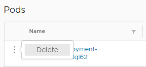

# Actions

> Actions is a concept internal to Octant. As the name implies, it is some task that Octant executes against the cluster.

Instances of actions are the delete button when viewing a pod or menu entires along the datagrid shown above. These actions are typically bound to buttons or forms to trigger from user interaction.

Try applying a [Cron Job](https://kubernetes.io/docs/concepts/workloads/controllers/cron-jobs/) - some workload that is repeated on some interval to see additional actions such as pause/restart.

Although Octant has a predefined set of actions, plugin authors can also create their own set of actions to run.
