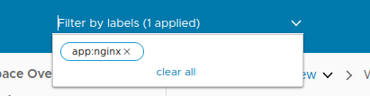

# Filtering

When running `kubectl get pods`, it can be straightforward if the cluster does not have a lot of things in it. However, one can see that pods of interest may be difficult to find if there were hundreds or thousands of pods.

Octant's overview page lists all objects and tables to list each of them. Typing `app:nginx` adds a filter to show only the relevant ones.

`kubectl get all -l app=nginx` offers a similar output. Octant helps manage one or more of these resource labels while the user browsers across multiple pages.
