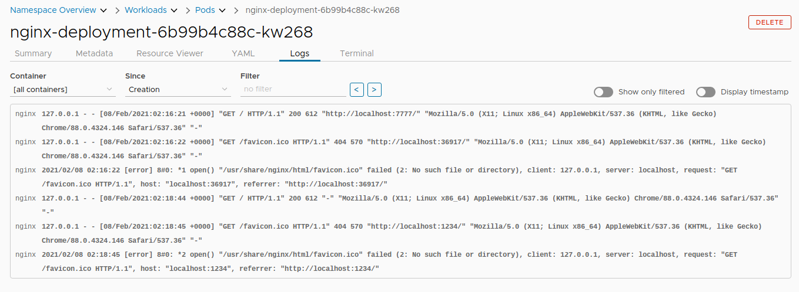

# Logging

Since nginx is a web server, it will log previous port forward requests.

The same equivalent from terminal would be `kubectl logs nginx-deployment-6b99b4c88c-kw268`.

Notice the command prints out the logs then ends. To continue following the logs, add `-f` which will show new log entries as they are added.

Additionally, a pod can have multiple containers. `kubectl` offers flags to tune the output whereas Octant has drop down menus to access logs instead.
