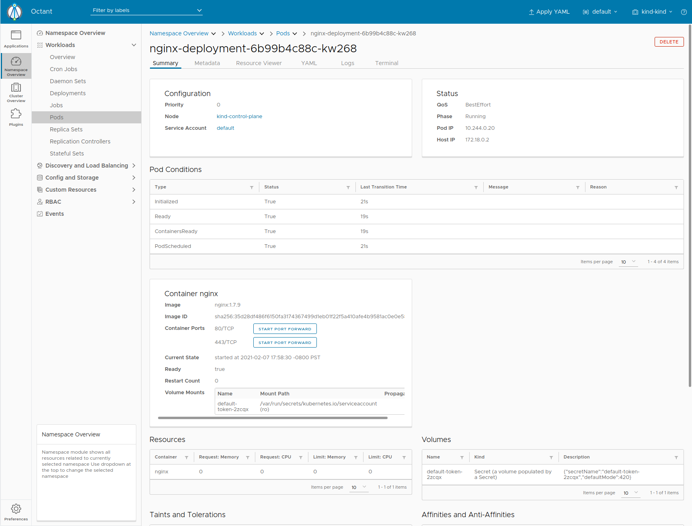

# Port Forwarding



Port forwarding in Kubernetes is used to access a container running on a cluster usually for debugging purposes.

Navigating to one of the pods created by the nginx deployment earlier, the summary tab shows some basic information about our running. 

Running `kubectl get pod nginx-deployment-6b99b4c88c-kw268` (your pod will be sligntly different), we can see Octant provides a more formatted output and buttons for what someone in this step might potentially do.

Next to `80/TCP`, click `Start Port Forward` and a new link should appear. That link should land on the nginx welcome page.

Going back to the terminal, run `kubectl port-forward pods/nginx-deployment-6b99b4c88c-kw268 1234:80`. Going to a browser and opening up http://localhost:1234 will show the landing page.

```
Forwarding from 127.0.0.1:1234 -> 80
Forwarding from [::1]:1234 -> 80
Handling connection for 1234
```

Octant helps the user avoid needing to know a verbose `kubectl` command and taking a few tries to get it correctly. It also generates a random port since it should not matter as long as it is accessible.
