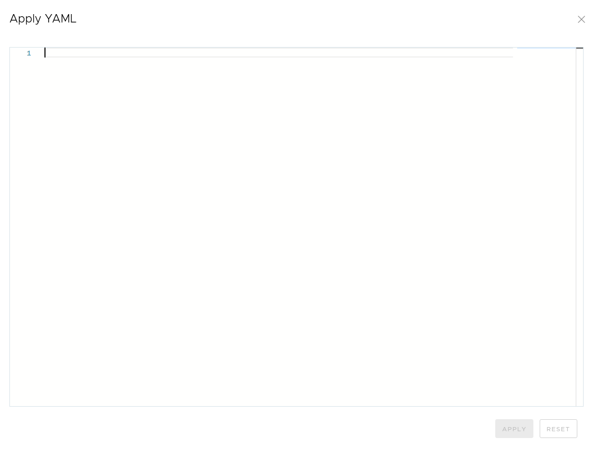
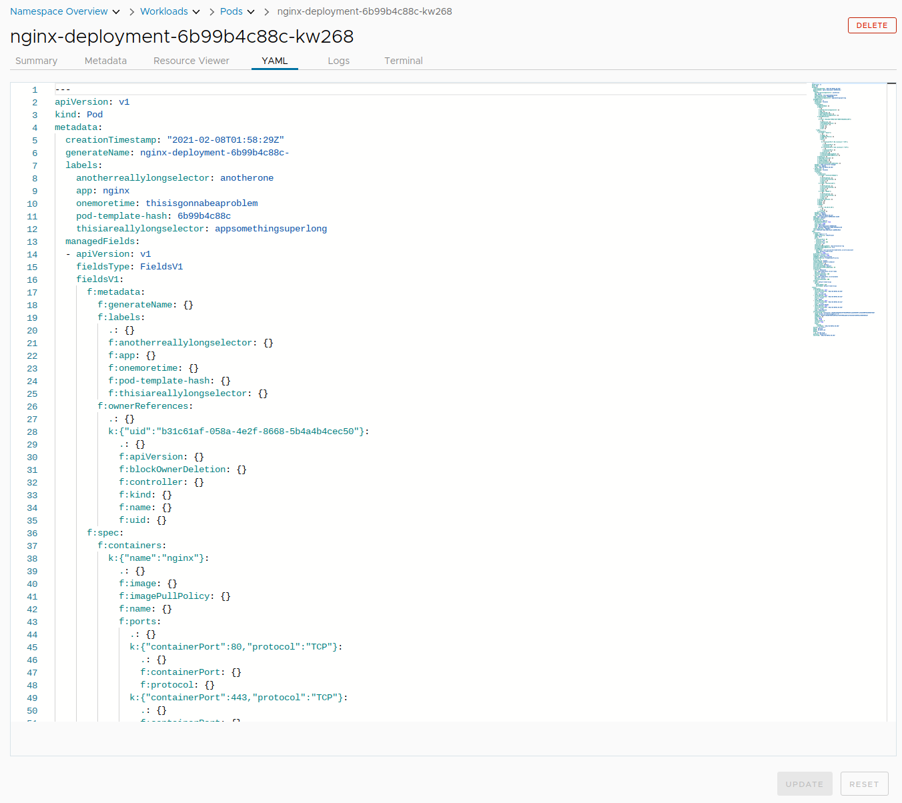

# YAML Editor

When adding objects to the cluster, `kubectl apply ...` is often used with a file or URL.

Octant can also do this though clicking `Apply YAML` on the top.

> Pro-tip: Use `Ctrl+y` to open this window.

The YAML can be copied and pasted into this window.

Another way is to edit YAML of an existing object. Navigate to a pod page and go to the YAML tab.

From here, the object can be inspected and edited manually.

The equivalent is `kubectl edit pod nginx-deployment-6b99b4c88c-kw268`. This would open a text editor in the teminal and behavir similarly to above.
